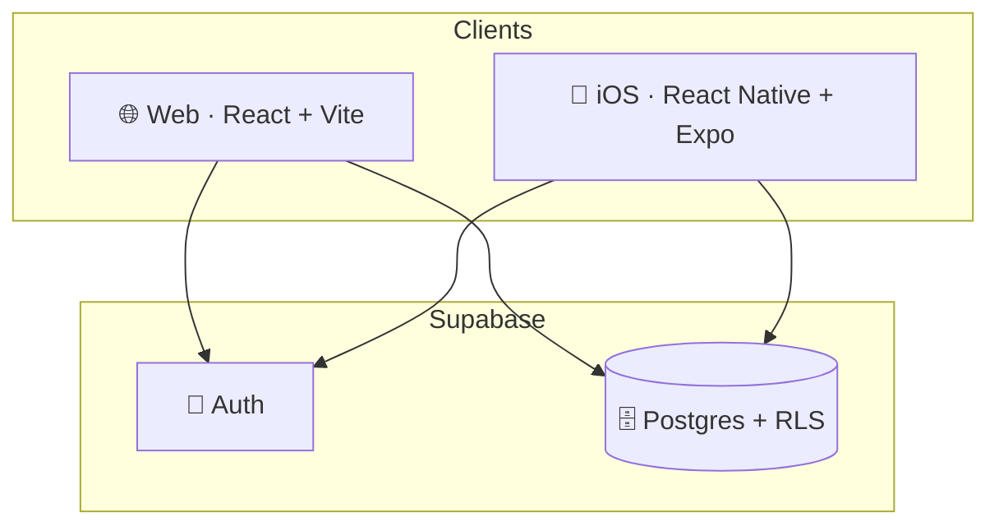

<div align="center">

# henami

**A personal dashboard for budgeting, calendar, training, nutrition and travel — on web and iOS.**

[](https://react.dev)
[](https://vite.dev)
[](https://expo.dev)
[](https://supabase.com)
[](https://vercel.com)

**English** · [🇳🇴 Norsk](README.no.md)


</div>

> **About this repo:** This is a _showcase_ of the henami project. The source code is private — here you'll find a description, screenshots, architecture and a few selected code snippets.

---

## ✨ What is henami?

henami is a personal productivity app I built from scratch. It brings together what I'd otherwise use five separate apps for — budgeting, calendar, training log, meal planning and a travel map — into one cohesive, customizable dashboard behind login.

The project comes in two variants that share the **same backend**:
- **Web** — React 19 + Vite, deployed on Vercel
- **iOS** — React Native + Expo, same data via Supabase

---

## 🧩 Features

| Module | Description |
|---|---|
| 🏠 **Home** | Customizable dashboard with key figures, today's events, habits and shortcuts |
| 💰 **Finances** | Budget with categories/groups, subscriptions, accounts and shared joint finances. Autosave. |
| 📅 **Calendar** | Month view, multi-day events, habits, goals, journal and reflection |
| 🏋️ **Training** | Training cycles, weekly programs, session logging and stats |
| 🥗 **Nutrition** | Weekly meal plan + shopping list |
| ✈️ **Travel** | Interactive world map (Mapbox) of visited countries and hikes |

<div align="center">

| Home | Finances | Calendar |
|---|---|---|
|  |  |  |

</div>

---

## 🛠️ Tech stack

**Frontend (web):** React 19 · Vite · React Router v7 · Recharts · Mapbox GL · lucide-react
**Mobile:** React Native · Expo · Expo Router
**Backend:** Supabase (Postgres · Auth · Row-Level Security)
**Hosting:** Vercel (web) · EAS / TestFlight (iOS)

See [docs/ARCHITECTURE.md](docs/ARCHITECTURE.md) for a technical deep dive.

---

## 💡 Selected code snippets

A couple of things I'm happy with from the codebase.

### Customizable theming via CSS variables
The entire app pulls its colors from CSS variables on `<html>`, so the user can override any individual color live — without re-rendering the React tree.

```js
useEffect(() => {
  const merged = { ...THEME_DEFAULTS[theme], ...customColors }
  const s = document.documentElement.style
  for (const key of Object.keys(merged)) {
    s.setProperty(CSS_VAR(key), merged[key])
  }
}, [theme, customColors])
```

### Defensive autosave in the budget
The budget saves automatically, but a naive implementation could wipe an entire month's rows if a fetch failed. The fix is a "safety lock": saving is only allowed when the data in state was provably loaded for exactly the month you're on.

```js
// Saving is ONLY allowed when the data in state provably belongs to the
// month we're on. Prevents a failed/empty fetch or a quick month switch
// from deleting real rows.
if (lastetNøkkel.current !== `${month}-${year}`) return
```

### Same backend, two clients
Web and iOS share a single Supabase database. All access is governed by row-level security (`auth.uid() = bruker_id`), so each user only sees their own rows — and sharing happens through dedicated `*_deling` (sharing) tables.

---

## 📐 Architecture at a glance



---

<div align="center">

Built by [Henrik Hagerup](https://github.com/henrikhhag) · Source code private

</div>
