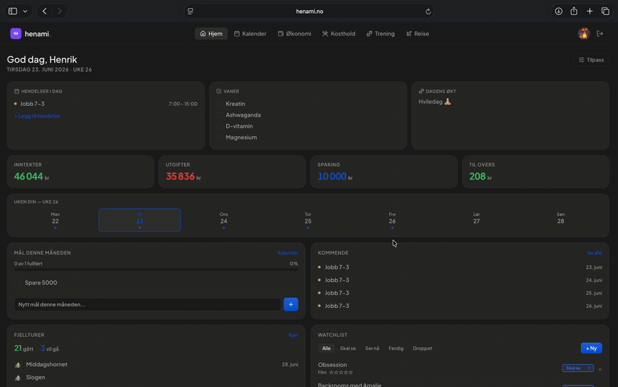
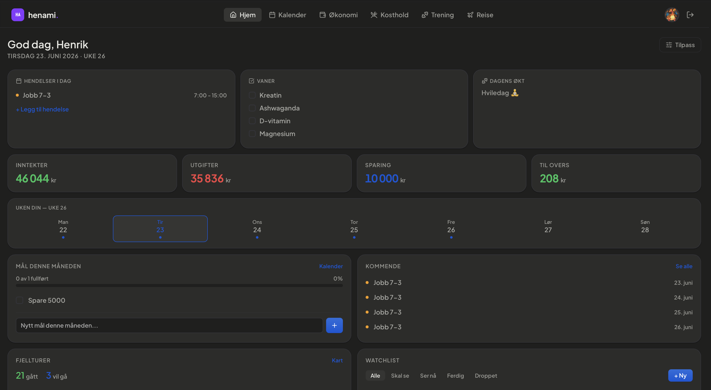
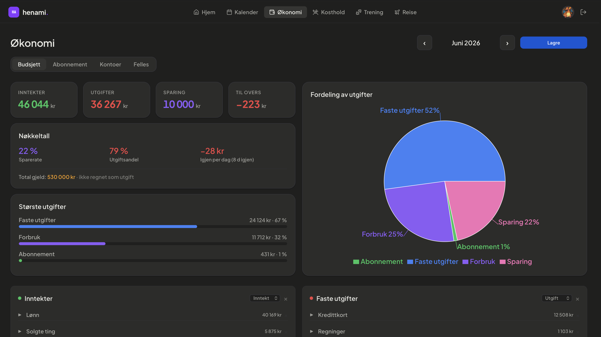
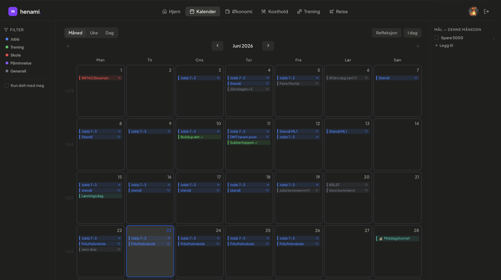
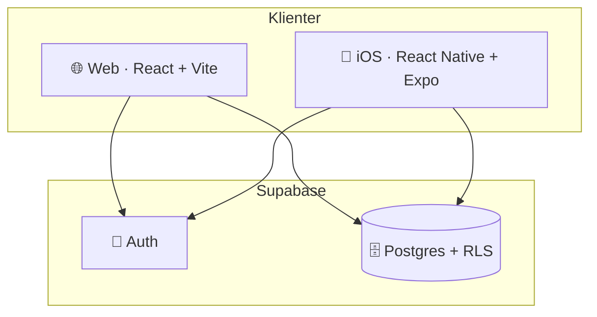

<div align="center">

# henami

**Et personlig dashboard for økonomi, kalender, trening, kosthold og reise – på web og iOS.**

[](https://react.dev)
[](https://vite.dev)
[](https://expo.dev)
[](https://supabase.com)
[](https://vercel.com)

[🇬🇧 English](README.md) · **Norsk**



</div>

> **Om dette repoet:** Dette er en _presentasjon_ av prosjektet henami. Selve kildekoden er privat – her finner du beskrivelse, skjermbilder, arkitektur og noen utvalgte kodebiter.

---

## ✨ Hva er henami?

henami er en personlig produktivitets-app jeg har bygget fra bunnen av. Den samler det jeg ellers ville brukt fem ulike apper til – budsjett, kalender, treningsdagbok, måltidsdagbok og reisekart – i ett sammenhengende, tilpassbart dashboard bak innlogging.

Prosjektet finnes i to varianter som deler **samme backend**:
- **Web** – React 19 + Vite, deployet på Vercel
- **iOS** – React Native + Expo, samme data via Supabase

---

## 🧩 Funksjoner

| Modul | Beskrivelse |
|---|---|
| 🏠 **Forside** | Tilpassbart dashboard med nøkkeltall, dagens hendelser, vaner og snarveier |
| 💰 **Økonomi** | Budsjett med kategorier/grupper, abonnement, kontoer og delt felles-økonomi. Autolagring. |
| 📅 **Kalender** | Måneds­visning, hendelser over flere dager, vaner, mål, dagbok og refleksjon |
| 🏋️ **Trening** | Treningsperioder, programmer per uke, øktlogging og statistikk koblet opp mot Strava |
| 🥗 **Kosthold** | Måltidsdagbok per uke og dag + handleliste |
| ✈️ **Reise** | Interaktivt verdenskart (Mapbox) over besøkte land og fjellturer |

<div align="center">

| Forside | Økonomi | Kalender |
|---|---|---|
|  |  |  |

</div>

---

## 🛠️ Tech stack

**Frontend (web):** React 19 · Vite · React Router v7 · Recharts · Mapbox GL · lucide-react
**Mobil:** React Native · Expo · Expo Router
**Backend:** Supabase (Postgres · Auth · Row-Level Security)
**Hosting:** Vercel (web) · EAS / TestFlight (iOS)

Se [docs/ARCHITECTURE.md](docs/ARCHITECTURE.md) for et teknisk dypdykk.

---

## 💡 Utvalgte kodebiter

Et par ting jeg er fornøyd med fra kodebasen.

### Tilpassbart tema via CSS-variabler
Hele appen henter farger fra CSS-variabler på `<html>`, så brukeren kan overstyre hver enkelt farge live – uten å re-rendre React-treet.

```js
useEffect(() => {
  const merged = { ...THEME_DEFAULTS[theme], ...customColors }
  const s = document.documentElement.style
  for (const key of Object.keys(merged)) {
    s.setProperty(CSS_VAR(key), merged[key])
  }
}, [theme, customColors])
```

### Defensiv autolagring i budsjettet
Budsjettet lagrer automatisk, men en naiv implementasjon kunne slettet en hel måneds rader hvis en henting feilet. Løsningen er en «sikkerhetslås»: lagring er kun tillatt når dataene i state beviselig ble lastet for nøyaktig den måneden man står på.

```js
// Lagring er KUN lov når dataene i state beviselig tilhører måneden vi står på.
// Hindrer at en feilet/tom henting eller et raskt måned-bytte sletter ekte rader.
if (lastetNøkkel.current !== `${måned}-${år}`) return
```

### Samme backend, to klienter
Web og iOS deler én Supabase-database. All tilgang styres av row-level security (`auth.uid() = bruker_id`), så hver bruker kun ser sine egne rader – og deling skjer via egne `*_deling`-tabeller.

---

## 📐 Arkitektur i korte trekk



---

<div align="center">

Bygget av [Henrik Hagerup](https://github.com/henrikhhag) · Kildekode privat

</div>
